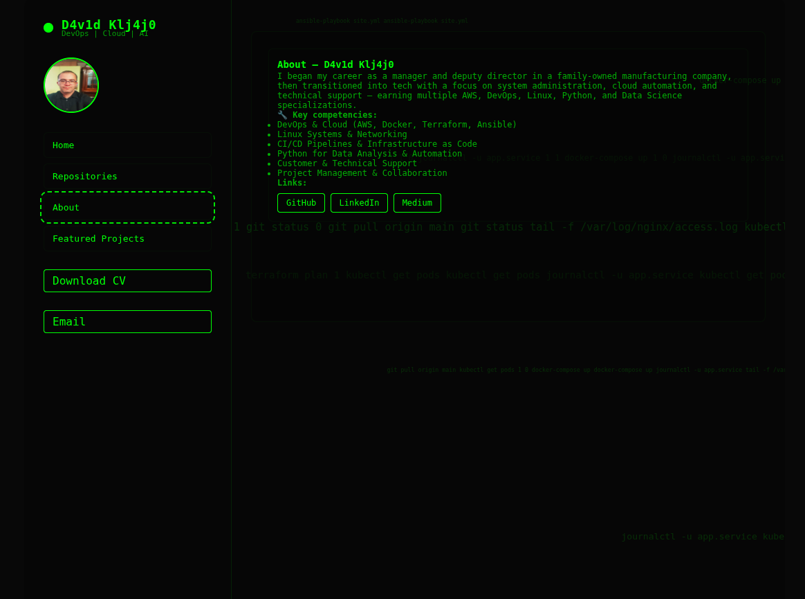

# D4v1d Klj4j0 — Hacker Terminal Portfolio

Welcome to my **personal portfolio website**, showcasing my work in **DevOps, Cloud, Linux, Python, and Automation**. This repository hosts the source code for my interactive terminal-style web page.

---
# David Kljajo - DevOps Engineer

Welcome to my portfolio repository! This showcases my professional experience, skills, projects, and contributions in the field of DevOps, cloud infrastructure, and automation.

## 🚀 About Me

I am a **DevOps Engineer** specializing in AWS, Docker, Kubernetes, Python automation, and Linux systems. I have a strong focus on:

- Infrastructure as Code (Terraform, Ansible)
- CI/CD pipelines and container orchestration
- Cloud migration and AWS solutions architecture
- Site Reliability Engineering and system optimization

📍 Available for **Remote Work Worldwide**  
📧 Contact: [davidkljajo@gmail.com](mailto:davidkljajo@gmail.com)  
🔗 LinkedIn: [linkedin.com/in/david-kljajo](https://www.linkedin.com/in/david-kljajo/)  
🐙 GitHub: [github.com/dkljajo](https://github.com/dkljajo)

---

## 🛠 Core Skills

| Skill         | Proficiency |
|---------------|------------|
| AWS           | 90%        |
| Docker        | 85%        |
| Kubernetes    | 80%        |
| Python        | 85%        |
| Terraform     | 70%        |
| Linux         | 90%        |

---

## 💼 Professional Experience

### Technical Support Specialist | Nsoft, Mostar
*March 2024 – June 2024*  
- Hardware and software troubleshooting  
- Zendesk support system management  
- Team collaboration and customer support  

### AWS DevOps Mentorship | AllOps, Mostar
*February 2023 – November 2023*  
- Linux/Unix administration and web servers  
- AWS cloud computing and Infrastructure as Code  
- CI/CD pipelines and monitoring with ELK stack  
- HashiCorp tools and system performance optimization  

### System Admin Bootcamp | Nsoft, Mostar
*April 2022 – May 2022*  
- Linux processes, networking, and containers  
- Docker images and Kubernetes orchestration  
- Database management (SQL, Redis, RabbitMQ)  
- Linux security and system administration  

### Deputy Manager | Mičel, Mostar
*June 2006 – May 2017*  
- Managed PVC manufacturing company operations  
- 11 years of leadership and business management experience  

---

## 🏆 Certifications

- [AWS Certified Solutions Architect – Associate](https://www.credly.com/users/david-kljajo)  
- [AWS Certified DevOps Engineer – Professional](https://www.credly.com/users/david-kljajo)  
- Credly verified badges for DevOps and Cloud technologies  

---

## 💻 Projects

### Enterprise Knowledge Assistant with AWS Bedrock
- AI-powered enterprise search solution using **Amazon Bedrock** and **OpenSearch**  
- **Outcome:** Reduced search time by 60%, serverless architecture  
- GitHub: [Link](https://github.com/dkljajo/Enterprise-Knowledge-Assistant-Powered-by-Amazon-Bedrock-OpenSearch)  

### Full-Stack Kubernetes Application on AWS EKS
- Complete containerized application deployment using **Docker** and **Kubernetes** on AWS EKS  
- **Outcome:** 99.9% uptime, 40% cost reduction  
- GitHub: [Link](https://github.com/dkljajo/My-First-Full-Dockerized-Kubernetes-Deployed-Web-App-)  

### diplomski eApartmani
- Full-stack web portal for renting apartments  
- **Outcome:** Implemented messaging, reviews, booking, and search features  
- GitHub: [Link](https://github.com/dkljajo/david-kljajo-devops-mentorship)  

---

## 📊 GitHub Stats

  
  
  

---

## ⚡ Fun Facts

- Completed **5 Coursera AI specializations**  
- Contributed to **open-source projects**  
- Published **15+ technical stories on Medium**  

---

## 📫 Contact Me

- Email: [davidkljajo@gmail.com](mailto:davidkljajo@gmail.com)  
- LinkedIn: [linkedin.com/in/david-kljajo](https://www.linkedin.com/in/david-kljajo/)  
- GitHub: [github.com/dkljajo](https://github.com/dkljajo)  

---

*This repository serves as a live representation of my portfolio and projects. Feel free to explore, collaborate, or reach out!*

